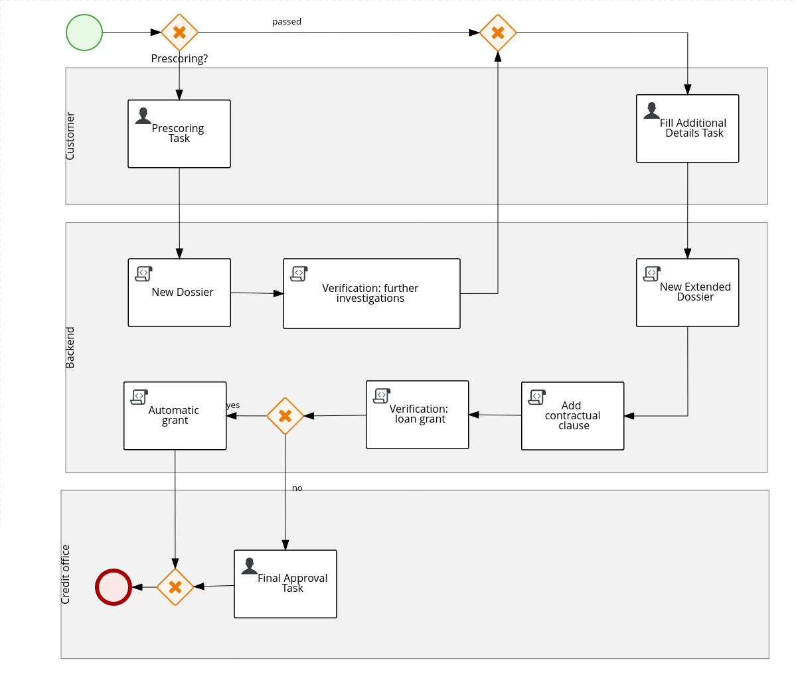

bank-loan example
=============================

Example of a bank-loan BPM service with spring boot.<br>
The project is composed by a kjar, representing a sample bank-loan BPMN process and by a kie-server running on spring boot.<br>

This is an image showing the BPMN process:


## OpenShift Environment installation

### Prerequisites

### Overview

The bank-loan-service is a spring boot application running the PAM capabilities.

It deploys, when started, the bank-loan-kjar, using the LocalContainerStartupStrategy.

PAM capabilities are defined in application-openshift.properties files: 

kieserver.drools.enabled=true<br>
kieserver.jbpm.enabled=true<br>
kieserver.dmn.enabled=false<br>
kieserver.jbpmui.enabled=true<br>
kieserver.casemgmt.enabled=false<br>

PAM job executor (executes the async tasks) has been defined using these properties:

jbpm.executor.enabled=true<br>
jbpm.executor.retries=5<br>
jbpm.executor.interval=10<br>
jbpm.executor.threadPoolSize=1<br>
jbpm.executor.timeUnit=SECONDS<br>

PAM DBMS connection details and JPA features have been defined with the properties starting with the prefix:<br>
spring.datasource*<br>
spring.jpa*

Deployment of kjars are not controlled by an external process-controller (for example a business central) but the kie-server uses an xml file (kie-server-state-file) with the list of kjar containers to deploy at startup.
The containers (kjars) must exist into the local maven repository in order to be deployed (they are not downloaded from nexus).
The maven dependencies (required by the kie-server and kjars) will be loaded using the telkom nexus repositories (as defined in maven settings.xml file).

Ther kie-server-state file defines also the properties to connect the kie-server to an external process controller (for monitoring):

org.kie.server.controller<br>
org.kie.server.controller.user<br>
org.kie.server.controller.pwd


The kie server security has been defined in a Spring WebSecurityConfigurerAdapter.
The /rest** context (pam rest APIs are accessible from this context) is under authentication.

User and kie server specific roles (rest-all,kie-server) are hard coded inside the class (inMemoryAuthentication)

A custom Dockerfile has been provided based on openjdk18-openshift image (latest).

A custom maven repository is created inside the image containing the bank-loan-kjar.
When the kie server starts up, it needs that kjar exists in the local maven repository (it will not be loaded from nexus).

### Deploy the kie server

```bash
   mvn -s ${NEXUS_MAVEN_SETTINGS} fabric8:build -Dfabric8.namespace=${build_environment}
```

Generate & Apply DeploymentConfig:

```bash
mvn -s ${NEXUS_MAVEN_SETTINGS} fabric8:resource fabric8:resource-apply -Dfabric8.openshift.enableAutomaticTrigger=false -Dfabric8.openshift.imageChangeTrigger=false -Dfabric8.namespace=${deploy_environment} -Dfabric8.generator.name=docker-registry.default.svc:5000/${build_environment}/${service_name}:1.0.0
```

Deploy to OpenShift:

```bash
oc rollout latest dc/${deploy_config} -n ${deploy_environment}
```


## Local Environment installation

### Prerequisites

You need an existing PAM business central listening at localhost:8080 (for monitoring the kie server).<br>
You need to define these two properties for the business central in order to monitor the kie-server:
```bash
<property name="org.kie.server.user" value="executionUser"/>
<property name="org.kie.server.pwd" value="executionUser"/>
```

### Install the kjar in your .m2 repo

```bash
  cd bank-loan-kjar
  mvn clean install
```

### Define the kie server properties

The list of kie containers (groupId, artifactId version) to deploy at startup must be defined inside the bank-loan-service.xml file.<br>
The kjars must exists inside your local .m2 maven repository.

Several application.properties are defined, each one with a specific database configuration:
 - h2 (default)
 - mysql

You can configure the user/password to connect with the controller (Business Central) through the following system properties inside the bank-loan-service.xml file:

```bash
 org.kie.server.controller.user=<user>
 org.kie.server.controller.pwd=<password>
```

### Custom Rest endpoint

A custom rest endpoint, registered under path /rest/pam is available and it adds additional APIs to the kie server.

### Run a kie-server and deploy a kjar

```bash
  cd bank-loan-service
  mvn clean && mvn spring-boot:run -Dorg.kie.server.startup.strategy=LocalContainersStartupStrategy -Dspring-boot.run.profiles=h2 -Ph2
```

### Run a kie-server and deploy a kjar with mysql dbms

```bash
  cd bank-loan-service
  mvn clean && mvn spring-boot:run -Dorg.kie.server.startup.strategy=LocalContainersStartupStrategy -Dspring-boot.run.profiles=mysql -Pmysql
```


### Swagger

Swagger is available at:
http://localhost:8090/rest/api-docs

load the json definition:
http://localhost:8090/rest/swagger.json

